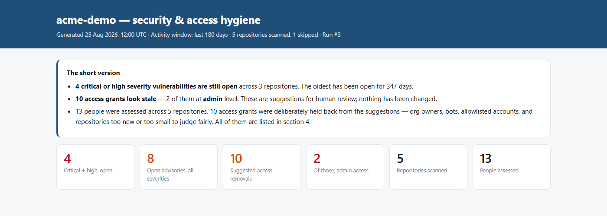
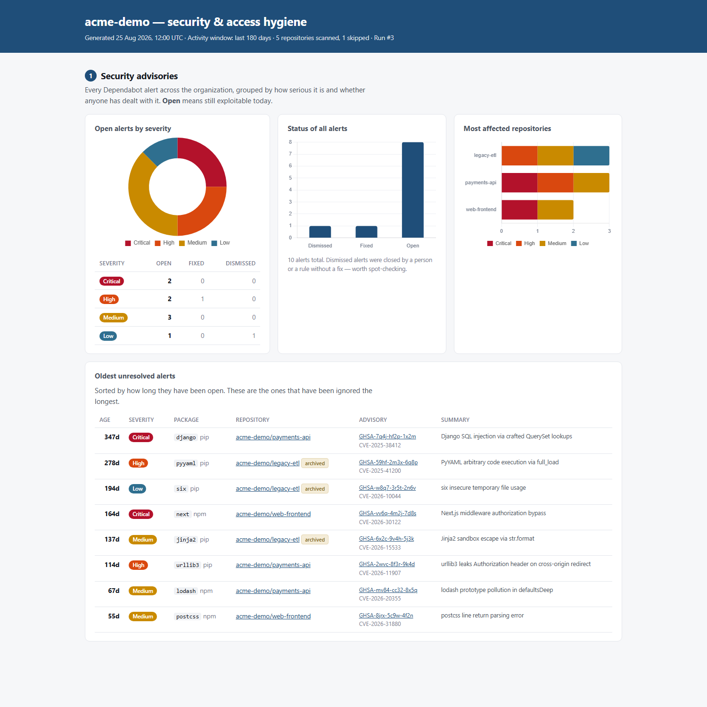
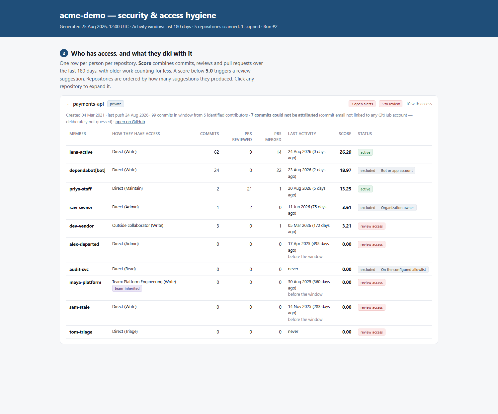
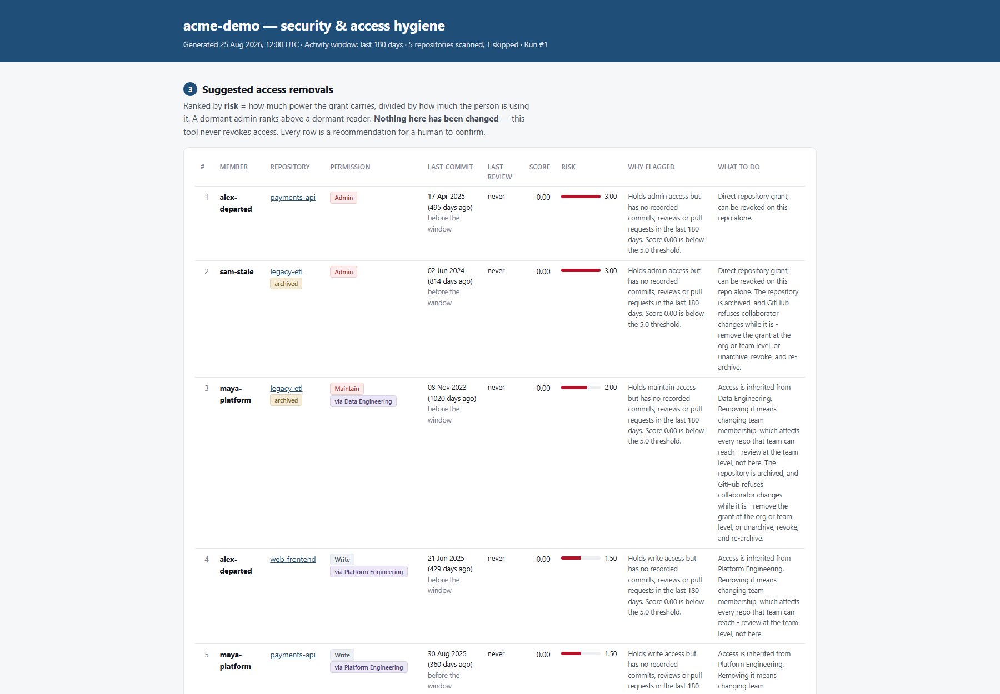
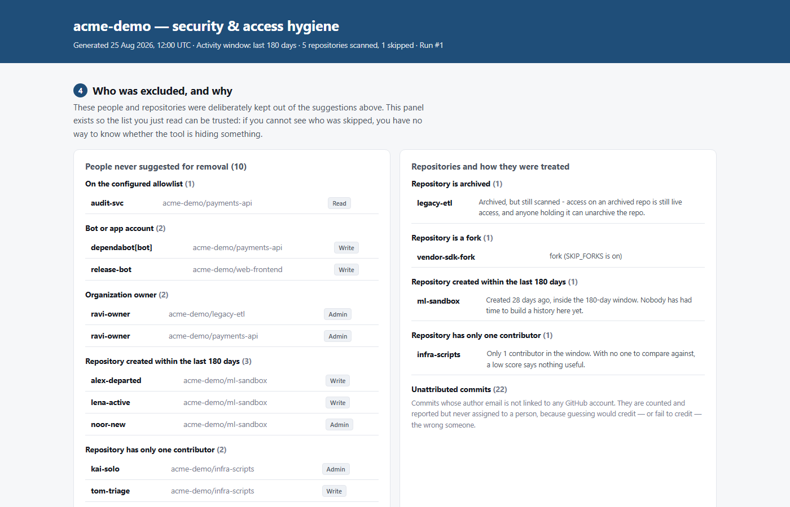
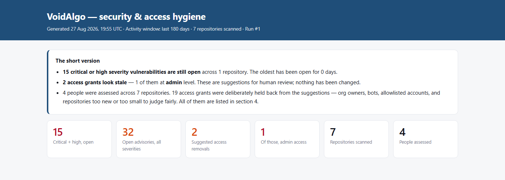
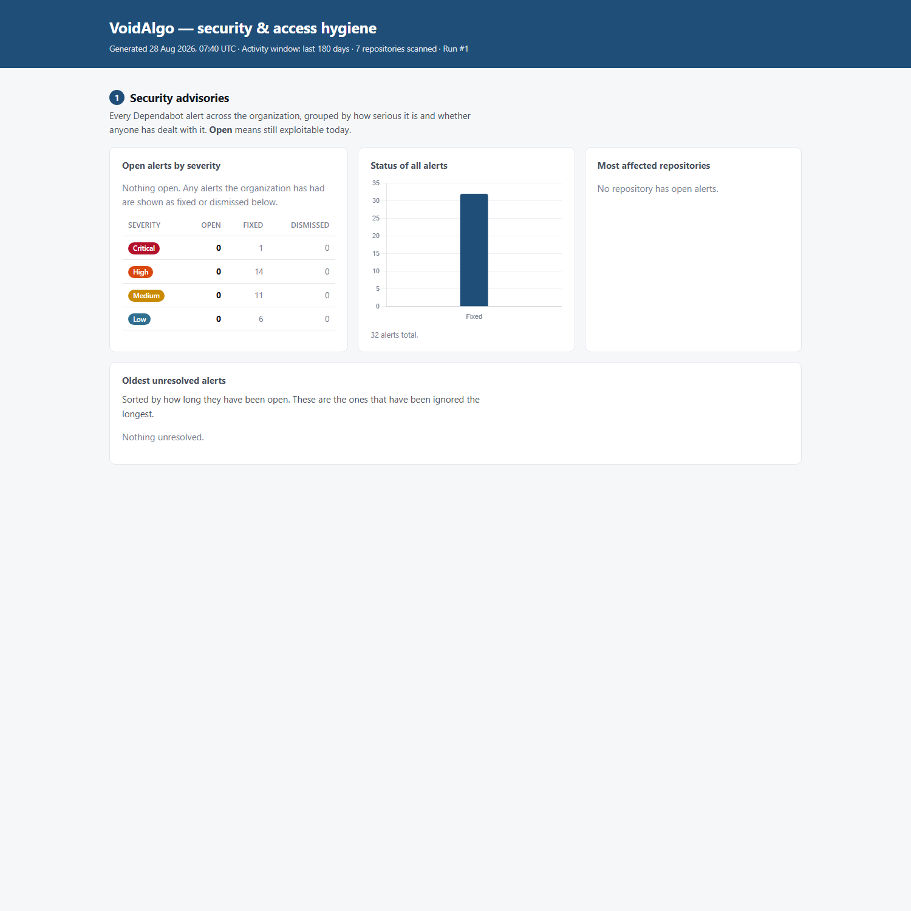
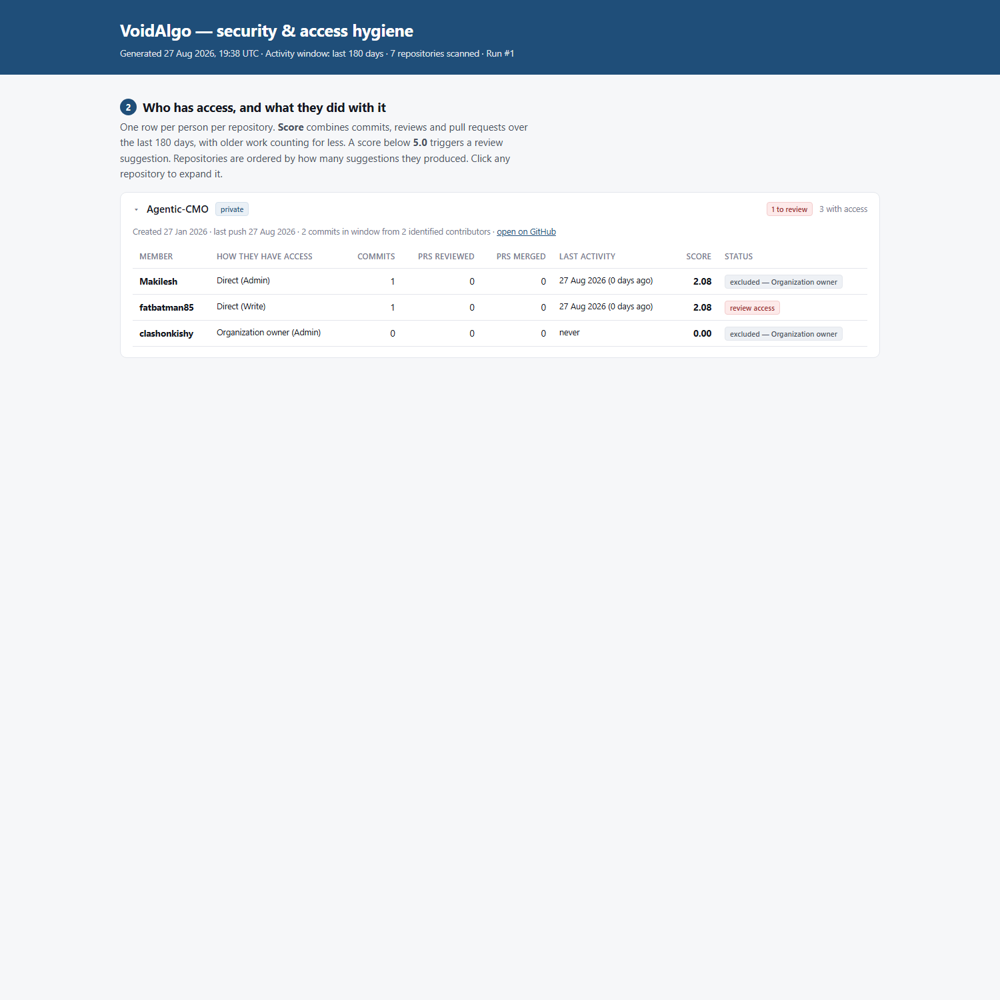
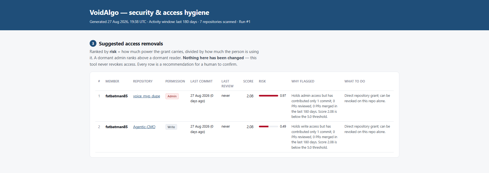
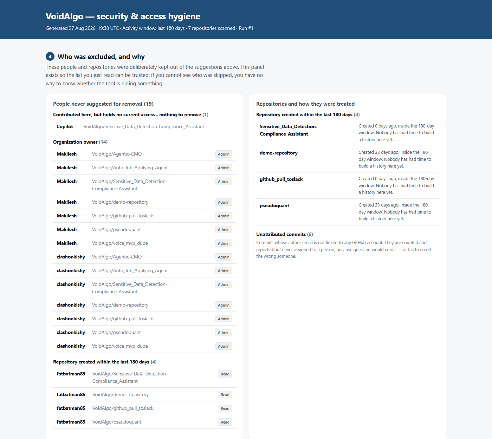

# Execution report — step by step, with captured output

This document walks through an actual execution of the scanner and records what
each step produced. Every block below is real terminal output, pasted unedited.

The reference run uses **demo mode**, because it is reproducible: the fixture
pins its clock, so anyone running the same command on any machine on any day
gets these exact numbers. **Step 8 is a real run against a live GitHub
organization**, with the token permission probe that preceded it.

Environment: Windows 11, Python 3.12.10, httpx 0.28.1, Jinja2 3.1.6.

---

## Step 1 — Environment setup

```bash
python -m venv .venv
```

```bash
.venv\Scripts\python.exe -m pip install -r requirements-dev.txt
```

Installs `httpx`, `Jinja2` and `pytest`. Chart.js is already vendored in
`vendor/chart.umd.min.js` so the dashboard needs no network at view time.

---

## Step 2 — Test suite

```bash
python -m pytest -q
```

```
........................................................................ [ 52%]
.................................................................        [100%]
156 passed in 0.32s
```

**156 tests, 0.32 seconds.** They cover:

| File | What it pins |
| ---- | ------------ |
| `tests/test_score.py` (80) | The scoring arithmetic against hand-computed values, decay behaviour, risk ordering, every NEVER-FLAG rule, and the remediation advice for team-inherited and archived grants |
| `tests/test_client.py` (33) | Rate-limit pauses, `Retry-After`, 409/403/404 handling, ETag 304s, cursor pagination, GraphQL error types |
| `tests/test_pipeline.py` (32) | The whole fixture org end-to-end: who is flagged, in exactly what order, who is excluded and why, plus database idempotency |
| `tests/test_access.py` (11) | A refused collaborator listing is reported, never rendered as "nobody has access"; org base permission is not team-inherited |

The same suite runs in CI on Python 3.11 and 3.12, followed by a full `--demo`
run whose findings are asserted against the numbers published in Step 3 below —
so this report cannot silently drift from the code.

The scoring tests assert exact arithmetic, not plausibility — for example that
`activity_score(commits=10)` equals `7.1936858`, which is `3.0 × ln(11)` computed
independently.

---

## Step 3 — The scan

```bash
python main.py --demo
```

```
13:31:23  INFO    scanner: Demo mode: acme-demo from fixtures\demo_org.json, clock pinned to 2026-08-25T12:00:00+00:00
13:31:23  INFO    report: Dashboard written to out\dashboard.html (256 KB)

  Run #1 - acme-demo (demo)
  ----------------------------------------------------------
  Repositories scanned    5  (1 skipped)
  Advisories found        10  (8 still open)
  Access suggestions      10
  Excluded from review    10

  Highest risk:
     3.00  alex-departed - admin on acme-demo/payments-api
     3.00  sam-stale - admin on acme-demo/legacy-etl
     2.00  maya-platform - maintain on acme-demo/legacy-etl (team-inherited)
     1.50  alex-departed - write on acme-demo/web-frontend (team-inherited)
     1.50  maya-platform - write on acme-demo/payments-api (team-inherited)

  Dashboard: out\dashboard.html
```

### What happened, and why each number is what it is

**6 repositories in the org, 5 scanned.** `vendor-sdk-fork` is a fork and was
skipped (`SKIP_FORKS` defaults on) — recorded as a row with a reason, not
silently dropped. `legacy-etl` is archived and **was** scanned: stale admin
access on an archived repo is still live access.

**10 advisories, 8 open.** Includes 2 critical and 2 high still open. The oldest
unresolved is a Django SQL-injection advisory open for **347 days**.

**10 access suggestions from 25 collaborator grants.** The two highest are
dormant admins scoring 0.00, so their risk equals the raw admin weight of 3.00.

**Three of the top five are team-inherited** and are labelled as such, with an
action column explaining that removing them means changing team membership.

### Who was *not* flagged, and why that is the interesting part

| Person | Situation | Outcome |
| ------ | --------- | ------- |
| `priya-staff` | 2 commits, **21 reviews** on payments-api | **Not flagged**, score 13.25 — a commit-count model would have flagged her |
| `lena-active` | 62 commits, 9 reviews | Not flagged, score 26.29 |
| `ravi-owner` | Admin, 1 commit in 6 months | **Excluded** — org owner, never flagged regardless of activity |
| `dependabot[bot]` | Write access, 24 commits | **Excluded** — bot |
| `release-bot` | Write access, 15 commits | **Excluded** — bot (typed `Bot`, no `[bot]` suffix) |
| `audit-svc` | Read access, zero activity | **Excluded** — on the configured allowlist |
| everyone on `ml-sandbox` | Repo created 28 days ago | **Excluded** — no time to build a history |
| `tom-triage` on `infra-scripts` | Write, zero activity | **Excluded** — repo has only one contributor |

`priya-staff` is the case the scoring model exists to protect, and a dedicated
test fails if a future change flags her.

---

## Step 4 — Idempotency check

Running the identical command a second time against the same database:

```bash
python main.py --demo
```

```
### row counts after two runs
runs             2
repos            6
advisories       10
collaborators    25
contributions    25
scores           25
exclusions       14
run_progress     40
```

**Two runs, two `runs` rows — and every fact table unchanged.** 6 repos, not 12.
10 advisories, not 20. 25 scores, not 50. The facts were updated in place and
re-stamped with the newer `run_id`; only the run ledger and the per-run progress
log grew, which is exactly what should grow.

This is the idempotency requirement demonstrated rather than asserted, and
`test_pipeline.py::test_seeding_twice_does_not_duplicate_rows` enforces it on
every test run.

---

## Step 5 — Re-rendering without touching the API

```bash
python main.py --report-only
```

```
     2.00  maya-platform - maintain on acme-demo/legacy-etl (team-inherited)
     1.50  alex-departed - write on acme-demo/web-frontend (team-inherited)
     1.50  maya-platform - write on acme-demo/payments-api (team-inherited)

  Dashboard: out\dashboard.html
```

Rebuilds the dashboard from SQLite with zero network calls — useful for
iterating on the report, and for regenerating a view of a scan captured days
earlier.

---

## Step 6 — Machine-readable output

```bash
python main.py --demo --json
```

```json
{
  "run_id": 2,
  "org": "acme-demo",
  "mode": "demo",
  "started_at": "2026-08-25T07:58:24+00:00",
  "finished_at": "2026-08-25T07:58:24+00:00",
  "status": "completed",
  "repos_scanned": 5,
  "repos_skipped": 1,
  "repos_errored": 0,
  "repos_excluded": 4,
  "advisories_found": 10,
  "advisories_open": 8,
  "suggestions_made": 10,
  "members_excluded": 10,
  "collaborators_seen": 25,
  "top_suggestions": [
    {"login": "alex-departed", "repo": "acme-demo/payments-api",
     "permission": "admin", "risk": 3.0, "score": 0.0, "team_inherited": false},
    {"login": "sam-stale", "repo": "acme-demo/legacy-etl",
     "permission": "admin", "risk": 3.0, "score": 0.0, "team_inherited": false},
    {"login": "maya-platform", "repo": "acme-demo/legacy-etl",
     "permission": "maintain", "risk": 2.0, "score": 0.0, "team_inherited": true}
  ],
  "dashboard": "out/dashboard.html",
  "database": "data/scanner.sqlite3",
  "api": {}
}
```

Logs go to stderr, so stdout stays clean and pipeable:

```bash
python main.py --demo --json > summary.json
```

`"api"` is empty in demo mode because no requests were made. On a live run it
carries request count, cache hits, retries and rate-limit pauses.

---

## Step 7 — The dashboard

`out/dashboard.html` — one self-contained file, 256 KB with Chart.js inlined.
Open it directly in a browser; no server required. A committed copy lives at
[docs/demo_dashboard.html](docs/demo_dashboard.html), and a printed version at
[docs/pdf/dashboard.pdf](docs/pdf/dashboard.pdf).

The screenshots below are generated by `python tools/make_docs.py`, so they
cannot drift from the dashboard they document.

### Header — the answer before the data



A security lead reads three sentences and knows the state of the org. Everything
below is the evidence for those three sentences.

### Section 1 — Security advisories



Counts by severity and status, the most-affected repositories, and the oldest
unresolved alerts sorted by age — 347 days for the worst one. Note that two of
the oldest sit on an **archived** repository, which is exactly the kind of thing
that goes unnoticed when nobody walks the org by hand.

### Section 2 — Who has access, and what they did with it



One row per person per repo. `lena-active` scores 26.29; `priya-staff` scores
13.25 on 2 commits and 21 reviews — the case a commit-count model gets wrong.
Excluded people stay visible with their reason attached rather than vanishing.
The panel header also reports the **7 unattributed commits** on this repository.

### Section 3 — Suggested access removals



Ranked by risk. Every row carries last commit, last review, permission, how the
access was granted, why it was flagged, and what the reviewer would have to do
about it. Team-inherited grants say *"review at the team level"*; grants on an
archived repo add that GitHub refuses collaborator changes while a repo is
archived, so the fix is at org or team level.

### Section 4 — Who was excluded, and why



Org owners, bots, allowlisted accounts, and repositories too new or too small to
judge — each named, grouped by reason. This panel is what makes the list in
section 3 trustworthy: a reader who cannot see who was skipped has no reason to
believe the people who were not.

---

## Step 8 — Live run against a real organization

The fixture org above is the illustrative case. This is the same code against a
real GitHub organization (`VoidAlgo`), and it is here because running against
real data found four bugs that no fixture would have caught.

**Scanned 27 August 2026.** Everything in this step is that snapshot, including
the 32 open advisories. Step 9 records what was done about them afterwards, so
the two steps' counts differ on purpose — that is the point of the exercise, not
an inconsistency.

### Token permission probe

Every endpoint the tool depends on, probed individually before scanning:

| Endpoint | Result |
| -------- | ------ |
| `/rate_limit` | OK — REST 5000/5000, GraphQL 5000/5000 |
| `/orgs/{org}/members?role=admin` | OK — 2 owners |
| `/orgs/{org}/teams` | OK — 0 teams |
| `/orgs/{org}/repos` | OK — 4 repositories |
| `/orgs/{org}/dependabot/alerts` | OK — **32 alerts in a single call** |
| `/repos/{r}/collaborators` (×3 affiliations) | OK on all 4 |
| `/repos/{r}/commits`, `/pulls`, GraphQL | OK — 231 commits, 34 PRs |

The org-wide advisory endpoint is the efficiency decision paying off in
practice: **one paginated call returned all 32 alerts** rather than four
per-repo calls, and that ratio is what keeps a 100-repo org affordable.

### The scan

```
INFO  scanner: Started run #1 for VoidAlgo
INFO  scanner: Token OK. REST quota 5000/5000, GraphQL 5000/5000
INFO  scan:    Org VoidAlgo has 2 owner(s)
INFO  scan:    Org base permission is 'read': every member holds read on every repo
INFO  scan:    Found 7 repos in VoidAlgo; scanning 7, skipping 0
INFO  scan:    Org-level Dependabot endpoint returned 32 alerts across 1 repos
INFO  scanner: [1/7] VoidAlgo/Agentic-CMO
INFO  scanner: [2/7] VoidAlgo/Auto_Job_Applying_Agent
INFO  scanner: [3/7] VoidAlgo/demo-repository
INFO  scanner: [4/7] VoidAlgo/github_pull_toslack
INFO  scanner: [5/7] VoidAlgo/pseudoquant
INFO  scanner: [6/7] VoidAlgo/Sensitive_Data_Detection-Compliance_Assistant
INFO  scanner: [7/7] VoidAlgo/voice_mvp_dupe

  Run #1 - VoidAlgo (live)
  ----------------------------------------------------------
  Repositories scanned    7
  Advisories found        32  (32 still open)
  Access suggestions      2
  Excluded from review    19
  API                     51 requests, 0 served from cache, 0 rate-limit pauses

  Highest risk:
     0.97  fatbatman85 - admin on VoidAlgo/voice_mvp_dupe
     0.49  fatbatman85 - write on VoidAlgo/Agentic-CMO
```

### Advisory findings

**32 open Dependabot alerts, 15 of them critical or high**, all concentrated in
a single repository (all since fixed — see Step 9):

| Severity | Open |
| -------- | ---- |
| Critical | 1 |
| High | 14 |
| Medium | 11 |
| Low | 6 |

A sample, straight from the run:

| Severity | Package | Advisory | Summary |
| -------- | ------- | -------- | ------- |
| Critical | torch | GHSA-53q9-r3pm-6pq6 | PyTorch remote code execution |
| High | black | GHSA-3936-cmfr-pm3m | Arbitrary file writes from unsanitized input |
| High | pillow | GHSA-45hq-cxwh-f6vc | `Image.new()` bypasses the decompression-bomb check |
| Medium | Pillow | GHSA-4x4j-2g7c-83w6 | `WindowsViewer.get_command()` OS command injection |

One repository accounts for every open alert in the organization, which is
exactly the "most affected repositories" signal the dashboard exists to surface.

### Access findings — two suggestions, and the reasoning behind each

| # | Member | Repository | Permission | Score | Risk |
| - | ------ | ---------- | ---------- | ----- | ---- |
| 1 | fatbatman85 | voice_mvp_dupe | **Admin** | 2.08 | **0.97** |
| 2 | fatbatman85 | Agentic-CMO | Write | 2.08 | 0.49 |

> Holds admin access but has contributed only 1 commit, 0 PRs reviewed, 0 PRs
> merged in the last 180 days. Score 2.08 is below the 5.0 threshold.

Both are genuine low-contribution findings: a single commit against a threshold
calibrated at roughly four. The admin grant ranks first because risk divides
permission weight by contribution — same score, twice the consequence.

### What was *not* flagged, and why that matters more

| Situation | Outcome |
| --------- | ------- |
| `fatbatman85` holds **admin** on `Auto_Job_Applying_Agent` and made 3 commits | **not flagged** — active people keep their access |
| `Makilesh`, `clashonkishy` — admin everywhere | **excluded** — organization owners, a hard rule |
| `fatbatman85` read on 4 repos | **excluded** — org base permission, no repo grant to revoke |
| `Copilot` authored commits on `Sensitive_Data_Detection…` | **excluded** — holds no access, nothing to remove |
| `demo-repository`, `github_pull_toslack` | **excluded** — one contributor, nothing to compare against |
| `pseudoquant`, `Sensitive_Data_Detection…` | **excluded** — created inside the 180-day window |

19 access grants were assessed and held back, 2 were suggested. A tool that
flagged the active admin, or the owners, or the person whose read access comes
from an org-wide setting, would be worse than useless — the reviewer would stop
trusting the list on the first false positive.

### The live dashboard

The same four sections, rendered from the real organization. These are produced
by `python tools/make_docs.py`, from the committed
[docs/live/dashboard.html](docs/live/dashboard.html), so they cannot drift from
what the scan actually produced. A printed copy is at
[docs/pdf/live_dashboard.pdf](docs/pdf/live_dashboard.pdf).



Three sentences, then the numbers: 15 critical or high vulnerabilities open,
2 stale access grants, 21 people-repository pairs assessed.



32 open alerts, all in one repository — real CVEs against `torch`, `pillow` and
`black`. The "most affected repositories" chart collapses to a single bar,
which is itself the finding.



Seven repositories, each expandable. Note `Auto_Job_Applying_Agent`: the same
person who is flagged elsewhere holds **admin** here and is **not** flagged,
because they actually contributed.



Two suggestions, ranked by risk, each carrying its evidence and its remediation.



Nineteen grants held back, grouped by reason — organization owners, org base
permission, contributors with no access, repositories too new or too small.
This panel is what makes the two suggestions above believable.

---

### A limitation this run exposed

`voice_mvp_dupe` was, before the commits above, a repository with **three
admins and no commits in six months**. That is arguably the strongest possible
stale-access signal — an abandoned repository — and the single-contributor rule
suppressed it, because the rule was written for "only one person to compare
against" and treats zero contributors the same as one. Those are different
situations: one is thin evidence, the other *is* the evidence. Splitting them
is the first change I would make to the exclusion rules.

### Four bugs the live run found that fixtures never would

1. **A refused collaborator listing rendered as "nobody has access."** A token
   without `Administration: read` produced empty access lists that the report
   stated with full confidence. Now `AccessSnapshot.complete` separates *empty*
   from *unreadable*, and the dashboard leads with a red banner.
2. **Organization base permission mislabelled as team-inherited.**
   `default_repository_permission = "read"` puts every member into the `all`
   listing with no team involved. The remediation is one org-wide setting, not
   a team change, so it is now its own access path.
3. **Contributors with no access suggested for removal.** `Copilot` authored
   commits on a repository where it holds no permission, scored 2.08, and would
   have been recommended for the removal of access it never had.
4. **Advisory counts silently zeroed.** Two stages write `repo_stats`; the
   contribution pass overwrote the advisory pass's `open_advisories` with its
   default, so a repository with 32 stored alerts displayed "0 open alerts".
   The upsert is now a partial update.

All four became code changes with tests. Section 8 of
[DESIGN_NOTES.md](DESIGN_NOTES.md) records the reasoning.

### Idempotency and caching, verified live

A second identical run:

```json
"api": { "requests": 13, "cache_hits": 8, "retries": 0, "rate_limit_sleeps": 0 }
```

**8 of 13 requests served from stored ETags** — 304 responses, which do not
count against the API quota. Row counts after two full runs: `runs 2`, every
fact table unchanged. Idempotency and conditional caching confirmed against the
real API, not against mocks.

## Step 9 — The findings were acted on

A scan that nobody acts on is a report, not a tool. The live run's advisory
half found **32 open Dependabot alerts** concentrated in one repository, so the
obvious next step was to fix them and re-run.

| | Before | After |
| --- | ------ | ----- |
| Critical | 1 | 0 |
| High | 14 | 0 |
| Medium | 11 | 0 |
| Low | 6 | 0 |
| **Total open** | **32** | **0** |

The fix was seven pinned versions in `requirements.txt`
([VoidAlgo/Sensitive_Data_Detection-Compliance_Assistant@f98acbf](https://github.com/VoidAlgo/Sensitive_Data_Detection-Compliance_Assistant/commit/f98acbf)).

Two details from doing it are worth recording, because they are the kind of
thing the dashboard is supposed to make visible:

**One package was pinned low by another package.** `pillow` sat at 10.4.0
carrying the comment `# streamlit 1.39 requires pillow<11`. That single
constraint is why **seventeen of the thirty-two alerts** had accumulated on one
package: every Pillow advisory since was unfixable without first moving
Streamlit. Bumping Pillow alone does not resolve. Streamlit 1.54 relaxes the cap
to `pillow<13`, and only then does the Pillow fix become possible. A per-package
view of advisories would have shown seventeen separate problems; the actual
problem was one.

**Automated bumps stopped two short.** A Dependabot PR merged mid-way through
this work cleared 30 of the 32, but bumped `markdown` to 3.7 and `torch` to
2.12.1 — while the advisories required `>= 3.8.1` and `>= 2.13.0` respectively.
It also left the now-incorrect `pillow<11` comment in place. Checking the
resulting versions against each advisory's own vulnerable range, rather than
trusting that "Dependabot merged it" means "fixed", is what caught the gap.

The upgrade was verified rather than assumed, because torch moved eleven minor
versions and Streamlit fifteen: the full stack installs with no conflicts, every
runtime import succeeds, **all 148 of that project's tests pass**, and all 29 of
its `src` modules import.

---

### What is mocked, stated plainly

Only the GitHub API responses, and only in `--demo`. Private Dependabot
advisories require an organization with paid security features and genuinely
vulnerable dependencies, which is not reproducible for a review — the brief
explicitly permits mocking exactly this.

The fixtures are shaped like real API payloads and are fed through the **same**
`db.upsert_advisory`, `contrib.AccessEntry` and `score.assess_repo` functions the
live scan uses. There is no demo-only parsing or scoring path. What is mocked is
the network; everything above it is the production code.
